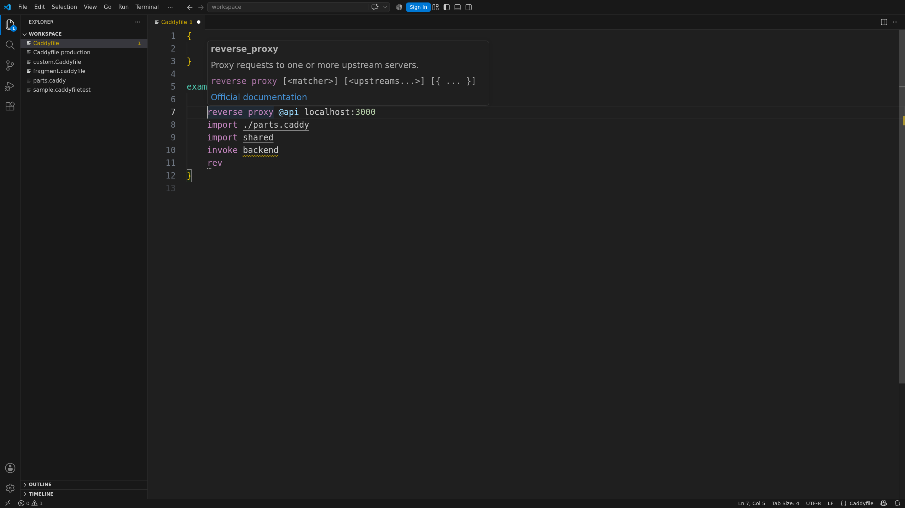
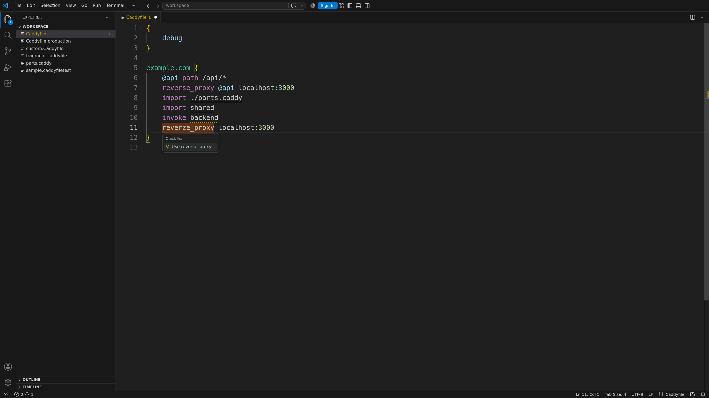

Completion suggests directives, options, matchers, subdirectives, and accepted values for the
current argument. Hover explains the selected item or value and links to Caddy's documentation.



Diagnostics find structural errors and close spelling mistakes. Unknown names stay hints because
Caddy modules can add directives.



## Route-scoped timeouts

The extension recognizes Caddy's experimental `timeouts` directive and its current options:

```caddyfile
example.com {
	timeouts {
		read_timeout 15s 1024
		write_timeout 15s 1024
		max_write_chunk 64KiB
	}
	respond ok
}
```

The optional number after a read or write timeout is the minimum transfer rate in bytes per second.
This directive is currently available in Caddy development builds and may change before a stable
Caddy release. An installed stable Caddy command can therefore reject it even though the extension
provides editing support.

Definitions, references, rename, symbols, folding, and selection work across imported files.

**Format Document** follows `caddy fmt`. It edits the open document and does not enable format on
save.

In `*.caddyfiletest` files, Caddyfile features stop at the `----------` separator. The expected JSON
keeps JSON highlighting and is never changed by Caddyfile formatting.
