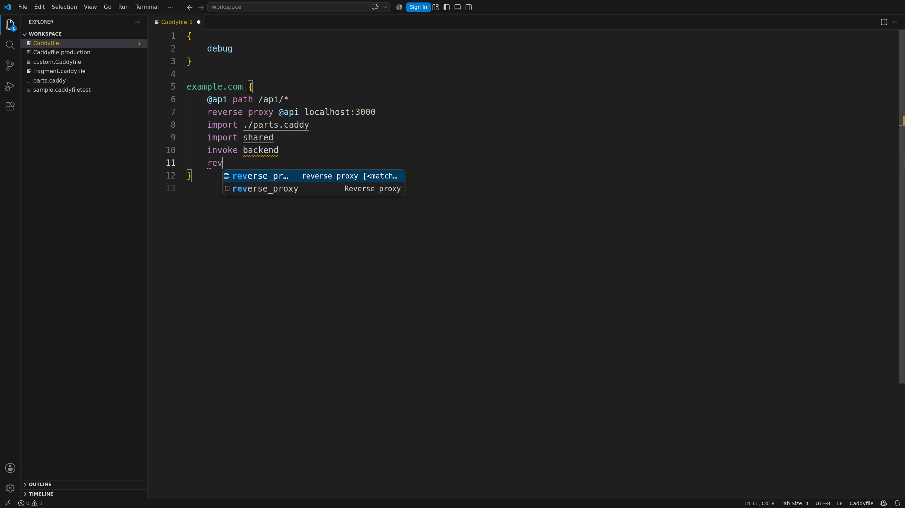

Highlight, complete, check, navigate, and format Caddyfiles.

```caddyfile
example.com {
	encode zstd gzip
	reverse_proxy localhost:3000
}
```



The extension works on desktop, remote hosts, and vscode.dev. Caddy is optional.

[Install the extension](./getting-started/) or read about [editing](./editing/).
